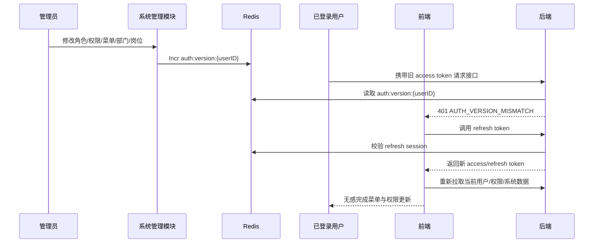
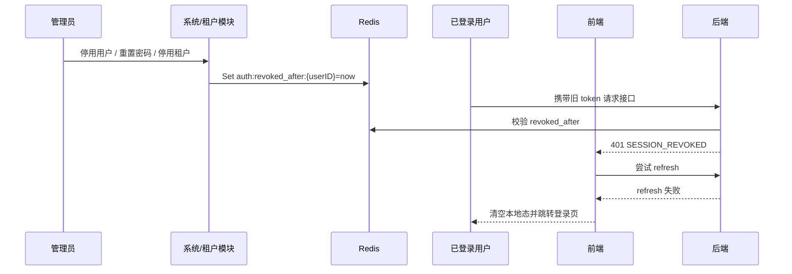

# 会话失效与权限刷新策略

## 1. 目标

这份文档专门说明：

- 哪些场景走“软刷新”；
- 哪些场景走“强制失效”；
- Redis Key 的命名与职责；
- 多租户下会话失效如何传播；
- 前后端如何协同完成实时刷新。

---

## 2. 设计原则

### 2.1 软刷新优先

如果只是“授权结果变化”，优先让用户无感刷新，而不是直接踢下线。

适用场景：

- 用户重新分配角色；
- 角色重新分配权限；
- 角色重新分配菜单；
- 菜单实体发生变更；
- 部门、岗位变化导致数据权限或界面上下文变化。

### 2.2 安全事件强制失效

如果是“账号安全状态变化”，必须立即让现有会话失效。

适用场景：

- 用户被停用；
- 用户被删除；
- 用户修改密码；
- 管理员重置密码；
- 租户被停用；
- 租户被删除。

---

## 3. 策略矩阵

| 场景 | 策略 | 原因 |
|:---|:---|:---|
| 用户角色变更 | 软刷新 | 授权变化，不一定是安全风险 |
| 角色权限变更 | 软刷新 | 用户应尽快拿到新权限 |
| 角色菜单变更 | 软刷新 | 前端导航与页面挂载需要更新 |
| 菜单名称/路径/组件/状态变更 | 软刷新 | 菜单树与页面挂载需要更新 |
| 部门变更 | 软刷新 | 影响数据范围、负责人、组织归属 |
| 岗位变更 | 软刷新 | 影响个人上下文与部分业务规则 |
| 用户停用 | 强制失效 | 账号不应继续使用 |
| 用户删除 | 强制失效 | 会话必须立即作废 |
| 修改密码 | 强制失效 | 防止旧会话继续使用 |
| 重置密码 | 强制失效 | 安全事件 |
| 租户停用 | 强制失效 | 租户全局不可用 |
| 租户删除 | 强制失效 | 租户级全量下线 |

---

## 4. Redis Key 规范

| Key | 示例 | 用途 |
|:---|:---|:---|
| `auth:session:{userID}:{jti}` | `auth:session:u1:j1` | Access Token 会话存在性校验 |
| `auth:refresh:{userID}:{jti}` | `auth:refresh:u1:j2` | Refresh Token 一次性轮换 |
| `auth:session:blacklist:{jti}` | `auth:session:blacklist:j1` | 单会话踢下线 |
| `auth:revoked_after:{userID}` | `auth:revoked_after:u1` | 用户级全量失效时间戳 |
| `auth:version:{userID}` | `auth:version:u1` | 用户授权版本号 |
| `auth:2fa:pending:{tempToken}` | `auth:2fa:pending:t1` | 2FA 待验证态 |

语义划分：

- `auth:version:{userID}`：用于软刷新；
- `auth:revoked_after:{userID}`：用于强制失效；
- `auth:session:*` / `auth:refresh:*`：用于会话存在性与 refresh rotation；
- `auth:session:blacklist:*`：用于单设备/单会话踢出。

---

## 5. 软刷新机制

### 5.1 核心思路

1. JWT Claims 携带 `auth_version`；
2. Redis 保存 `auth:version:{userID}`；
3. 角色、权限、菜单、部门、岗位等变化时，递增该用户或关联用户的版本号；
4. 鉴权中间件发现 `claims.auth_version < redis current_version` 时返回 `401`；
5. 前端拿到 `401` 后自动调用 refresh；
6. refresh 成功后重新拉取用户、权限、菜单、系统数据；
7. 前端界面无感更新。

### 5.2 当前已接入的软刷新触发点

- 用户角色变更；
- 角色权限变更；
- 角色菜单变更；
- 菜单实体更新或删除；
- 部门更新；
- 岗位更新或删除。

---

## 6. 强制失效机制

### 6.1 核心思路

1. Redis 维护 `auth:revoked_after:{userID}`；
2. 当用户或租户发生安全级状态变化时，写入当前时间戳；
3. Access Token / Refresh Token 在校验时比对 `issued_at`；
4. 只要 token 签发时间早于撤销时间，即视为失效；
5. 前端 refresh 也无法恢复，只能重新登录。

### 6.2 当前已接入的强制失效触发点

- 用户停用；
- 用户删除；
- 用户改密；
- 管理员重置密码；
- 租户停用；
- 租户删除。

---

## 7. 多租户下的失效传播

### 7.1 用户级

用户级失效只影响当前用户，与租户内其他用户无关。

### 7.2 角色级 / 菜单级

变更传播路径如下：

`角色/菜单变更 -> 查关联角色 -> 查关联用户 -> bump auth version`

### 7.3 租户级

租户停用/删除的传播路径如下：

`租户状态变化 -> 汇总该租户用户 -> 写 revoked_after -> 所有会话失效`

系统会同时覆盖：

- 主库中的平台侧用户记录；
- 租户库中的租户侧用户记录。

---

## 8. 前后端协同流程图

### 8.1 权限软刷新

### 8.2 强制失效

---

## 9. 前端刷新职责

前端在 refresh 成功后，必须同时执行：

1. `reloadAuthorization()`：刷新当前用户与权限；
2. `systemStore.initialize()`：刷新菜单、角色、系统数据；
3. 必要时重新检查租户状态。

### 9.1 当前实现入口

当前前端已经把这条刷新链路收敛到统一入口：

- 请求拦截与 `401` 处理：`frontend/src/shared/utils/api_client.ts`
- refresh 成功后的统一承接：`refreshTenantContext()`
- 认证信息重载：`reloadAuthorization()`
- 租户状态复查：`checkTenantStatus()`
- 系统级快照重建：`systemStore.initialize()`

当前实际流程如下：

1. 后端返回 `401 AUTH_VERSION_MISMATCH`
2. `api_client` 调用 refresh 接口
3. refresh 成功后执行 `authStore.refreshTenantContext()`
4. `refreshTenantContext()` 内部依次执行：
   - `reloadAuthorization()`
   - `checkTenantStatus()`
   - 若租户已就绪，再执行 `systemStore.initialize()`
5. 前端清理并重建标签页与菜单快照

这意味着文档中的“刷新当前用户 / 权限 / 系统数据 / 租户状态”不是分散在多个页面里完成，而是由认证链路统一收口。

这样才能保证：

- 顶部个人中心信息正确；
- 侧边栏菜单正确；
- 页面权限与按钮权限正确；
- 切换租户或租户初始化态不残留旧数据。

---

## 10. 推荐扩展

- 审计日志中显式记录“软刷新触发原因 / 强制失效触发原因”；
- 管理端增加“在线用户 / 在线租户会话”可视化页。
