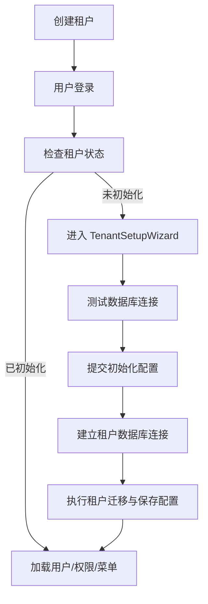

# 租户初始化与生命周期设计

## 1. 模块定位

多租户体系不是附属功能，而是整个后台管理平台底座成立的前提之一。

它要解决的不只是“一个系统支持多个租户”，而是更完整的一组问题：

- 平台支持哪种部署模式；
- 租户如何创建、初始化、启用、停用、删除；
- 租户数据库如何接入；
- 登录后如何进入正确的租户上下文；
- 系统管理与后续业务模块如何在租户维度上扩展。

### 1.1 本文负责什么

本文只说明租户体系的设计边界、初始化流程、生命周期和扩展规范。

### 1.2 本文不重复什么

- 认证安全与会话失效：见 `docs/auth/AUTH_SECURITY.md` 与 `docs/auth/AUTH_SESSION_STRATEGY.md`
- 系统管理对象关系：见 `docs/system/SYSTEM_MANAGEMENT.md`
- 数据库命名基线：见 `docs/tenant/DATABASE_NAMING_STRATEGY.md`
- 后端/前端具体代码落点：见 `backend/docs/tenant/TENANT_BACKEND.md` 与 `frontend/docs/tenant/TENANT_FRONTEND.md`

---

## 2. 租户体系的设计目标

你的平台不是一次性交付的后台，而是后续还要承载更多业务模块的底座，因此租户体系至少要满足以下目标：

- 支持私有化、PaaS、SaaS 三类演进路径；
- 支持部署模式可配置；
- 支持租户策略可配置；
- 支持租户初始化流程标准化；
- 支持认证、系统管理、权限模型闭环联动；
- 支持后续业务模块按租户维度平滑扩展。

简化理解：

- 认证解决“谁进来”；
- 租户体系解决“进来之后在哪个租户里运行”；
- 系统管理解决“在这个租户里怎么管人、管权、管菜单”；
- 业务模块解决“在这个租户里做什么业务”。

---

## 3. 部署模式与租户策略

推荐组合如下：

| 部署模式 | 租户策略 | 典型场景 |
| :--- | :--- | :--- |
| `private` | `single` | 私有化单租户交付 |
| `paas` | `mixed` | 平台底座 + 多业务线扩展 |
| `saas` | `dedicated` | 标准 SaaS 多租户运营 |

### 3.1 `private + single`

特点：

- 默认回落到平台默认租户；
- 登录页可以不强制输入租户编码；
- 架构上仍保留租户底座，便于后续平滑升级到多租户。

适合：

- 企业内部私有化部署；
- 单客户独立交付；
- 当前先单租户、后续可能要演进到平台化的场景。

### 3.2 `paas + mixed`

特点：

- 平台级能力与租户级能力并存；
- 核心公共模块可统一提供；
- 业务模块可按租户逐步挂载；
- 更强调“底座能力复用”。

适合：

- 统一运维平台；
- 多业务线共享账号、权限、菜单和审计底座；
- 平台化建设阶段。

### 3.3 `saas + dedicated`

特点：

- 每个租户拥有独立数据库连接；
- 初始化、权限、菜单、日志按租户隔离；
- 后续模块扩展统一走“租户迁移 + 菜单挂载 + 权限绑定”链路。

适合：

- 标准化 SaaS 产品；
- 多租户隔离要求高；
- 需要独立租户生命周期治理的场景。

---

## 4. 租户模型的核心边界

租户体系至少包含以下对象与职责：

- 租户主数据；
- 租户数据库配置；
- 租户初始化状态；
- 租户配额；
- 租户运行状态；
- 租户级连接管理；
- 租户级迁移器注册机制。

### 4.1 平台级数据与租户级数据的边界

- **平台级主数据**：租户本身、租户配置、配额、连接信息；
- **租户级业务数据**：用户、部门、岗位、角色、权限、菜单、日志、设置，以及后续业务模块自己的数据。

### 4.2 租户体系不直接承担什么

租户体系不直接替代：

- 系统管理业务；
- 认证安全逻辑；
- 具体业务模块领域逻辑；
- 部署运维工具本身。

它的职责更像“运行时底盘”和“租户生命周期控制器”。

---

## 5. 租户初始化完整流程

## 5.1 业务流程

推荐的租户初始化闭环如下：

1. 在平台管理端创建租户（数据库写入，目前无公开自注册端点）
2. 用户登录成功后检查租户状态：`GET /api/v1/tenants/current`
3. 若租户数据库未配置（`is_first_login=true`），前端进入 `TenantSetupWizard`
4. 测试连接：`POST /api/v1/tenants/test-connection`
5. 提交初始化：`POST /api/v1/tenants/setup`
6. 后端建立租户数据库连接并执行租户级迁移
7. 更新租户 `is_first_login=false`
8. 前端重新读取当前租户信息：`GET /api/v1/tenants/current`
9. 继续进入系统管理与后续业务模块

## 5.2 流程图

## 5.3 三阶段理解方式

建议把租户初始化拆成三个更清晰的阶段：

### 阶段一：平台开通

负责：

- 创建租户主记录；
- 生成租户编码；
- 设置租户初始状态；
- 设置部署模式、租户策略、基础配额。

### 阶段二：数据库接入

负责：

- 测试数据库连接；
- 建立连接池；
- 保存密文配置；
- 执行租户迁移。

默认命名建议：

- 平台主库：`pantheon_master`
- 监控库：`pantheon_monitor`
- 租户库：`pantheon_tenant_<tenant_code>`

默认表前缀建议：

- 平台主库：`tenant_`
- 租户运行库：`system_` / `auth_` / `notification_`
- Casbin 规则表：`casbin_rule`

若后续业务域确需物理拆库，再扩展为：

- `pantheon_tenant_<tenant_code>_<domain>`

### 阶段三：业务就绪

负责：

- 初始化系统管理默认数据；
- 初始化默认角色、菜单、权限；
- 初始化默认管理员或租户管理员；
- 首次登录引导完成后进入正式业务阶段。

---

## 6. 初始化链路中的关键职责

租户初始化不是简单的“配个数据库”，而是一条标准化的运行链路。

### 6.1 初始化时必须完成的事情

至少包括：

1. 校验租户身份与初始化权限；
2. 防止同一租户重复初始化；
3. 读取租户主数据；
4. 生成数据库连接信息；
5. 建立租户级连接；
6. 执行已注册的租户迁移器；
7. 保存租户数据库配置；
8. 更新初始化状态；
9. 返回当前租户是否已具备业务就绪条件。

### 6.2 初始化完成后默认应具备什么

建议初始化完成后，系统至少具备：

- 用户数据结构；
- 部门、岗位结构；
- 角色、权限、菜单结构；
- 操作日志、登录日志；
- 系统设置；
- 通知基础表；
- 数据字典等系统级支撑数据。

### 6.3 为什么要采用迁移器机制

因为后续新增业务模块时，如果每次都重写租户初始化逻辑，会让平台越来越难维护。

采用“租户迁移器注册”机制的好处是：

- 新模块可按标准接入；
- 初始化逻辑统一收口；
- 扩展模块无需破坏主流程；
- 平台天然适合长期演进。

---

## 7. 租户与认证体系的关系

租户初始化和认证体系是强协作关系。

### 7.1 登录态上的协作

登录成功后，认证模块要继续完成租户侧判断：

- 当前租户是否存在；
- 当前租户是否可用；
- 当前租户是否已经初始化完成；
- 当前用户是否允许进入该租户上下文。

### 7.2 初始化未完成时的行为

当租户数据库尚未初始化时：

- 允许用户完成登录；
- 允许进入租户初始化向导；
- 不允许直接进入完整业务界面；
- 初始化成功后再继续加载用户、权限、菜单与系统数据。

### 7.3 租户状态变化如何影响会话

- 租户停用：该租户下所有用户会话应强制失效；
- 租户删除：该租户下所有用户会话强制失效，并移除连接；
- 租户恢复：后续新会话可重新建立，但旧会话不应自动恢复。

这部分具体机制统一见 `docs/auth/AUTH_SESSION_STRATEGY.md`。

---

## 8. 租户与系统管理模块的关系

系统管理模块是租户初始化之后第一个进入正式运转的核心管理域。

### 8.1 为什么系统管理是初始化后的第一域

因为后续业务模块都依赖它提供：

- 用户体系；
- 部门与岗位体系；
- 角色权限体系；
- 菜单挂载；
- 日志与设置底座；
- 个人中心入口。

### 8.2 为什么租户初始化不能只建空库

如果初始化后没有系统管理的最小可用数据，后续业务模块就无法稳定接入。

因此租户初始化的目标不是“数据库连上了”，而是“该租户已经具备进入正式管理和扩展业务的最小能力集合”。

---

## 9. 运行期生命周期

租户除了初始化，还存在完整生命周期。

### 9.1 `active`

- 可登录；
- 可加载权限、菜单、系统数据；
- 可访问租户数据库；
- 可进入正式业务链路。

### 9.2 `disabled`

- 不再允许继续进入租户业务链路；
- 应关闭或停用租户级业务入口；
- 应撤销该租户下所有在线会话；
- 数据本身通常保留，便于后续恢复。

### 9.3 `deleted`

- 租户主记录进入删除流程；
- 租户连接移除；
- 该租户下所有会话全部撤销；
- 是否物理清理数据库应交由运维或专项流程执行。

### 9.4 生命周期控制要求

租户生命周期的每一步都建议伴随：

- 审计记录；
- 状态可追踪；
- 失败可回滚或可人工补偿；
- 与认证、系统管理状态保持一致。

---

## 10. 作为业务底座的扩展方式

租户体系存在的根本价值之一，是让后续业务模块可以按统一方式接入。

## 10.1 标准扩展步骤

新增模块时，推荐遵循以下步骤：

1. 新增租户级数据模型；
2. 实现租户迁移器；
3. 注册到租户初始化链路；
4. 定义菜单、权限、日志、监控接入点；
5. 前端新增页面组件；
6. 在系统管理中配置菜单与角色授权；
7. 登录后通过动态权限初始化自动挂载显示。

## 10.2 以主机管理为例

| 接入点 | 建议内容 |
| :--- | :--- |
| 后端模块 | `host/` |
| 前端页面 | 示例组件标识 `host/HostManagement` |
| 菜单配置 | `path=/host`、`component=host/HostManagement` |
| 权限配置 | `host:machine:view`、`host:machine:create` 等 |
| 审计 | 主机创建、编辑、删除、远程操作都需要审计 |
| 监控 | 主机状态与异常可接入系统监控或通知链路 |

### 10.3 扩展原则

- 不要把业务模块直接硬编码进主框架；
- 尽量通过“迁移器 + 菜单 + 权限码 + 前端组件”接入；
- 新模块进入后仍然遵守租户隔离；
- 新模块的初始化要服从租户初始化链路。

---

## 11. 推荐后续优化

当前这套设计已经能支撑平台底座，但后续仍建议继续补强：

- 将“种子数据初始化”从迁移阶段中显式分离出来；
- 为租户停用、恢复、删除提供清晰的管理端页面；
- 为不同部署模式补单独交付手册；
- 为业务模块扩展补统一注册规范；
- 为租户初始化过程补更细粒度审计与失败补偿机制。

---

## 12. 推荐阅读路径

- 先读 `docs/tenant/TENANT_INITIALIZATION.md`
- 再读 `docs/system/SYSTEM_MANAGEMENT.md`
- 再读 `docs/auth/AUTH_SECURITY.md`
- 再读 `docs/auth/AUTH_SESSION_STRATEGY.md`
- 最后进入 `backend/docs/tenant/TENANT_BACKEND.md` 与 `frontend/docs/tenant/TENANT_FRONTEND.md`
